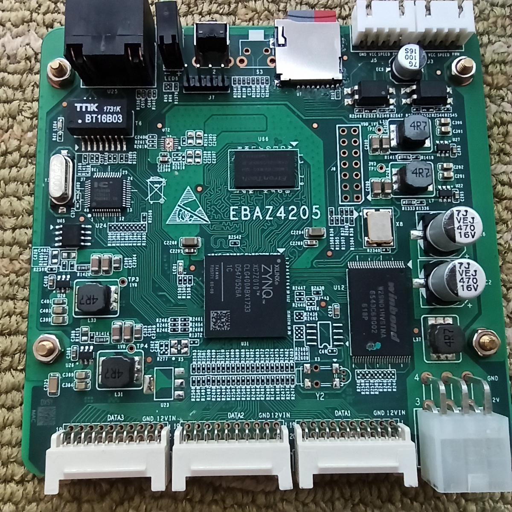
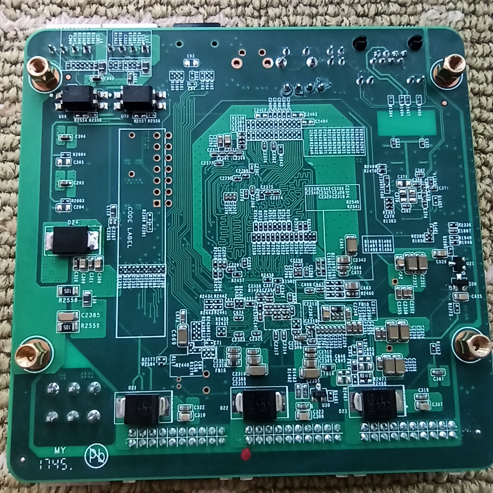
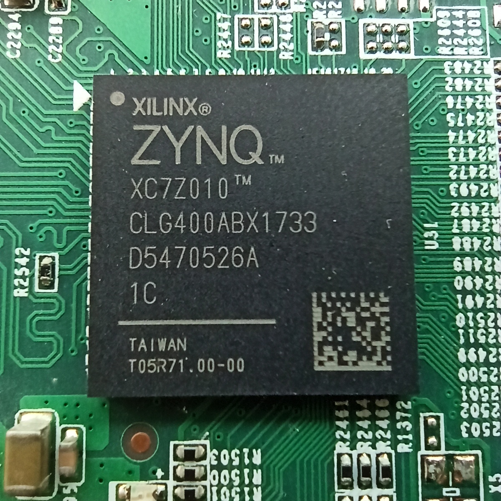
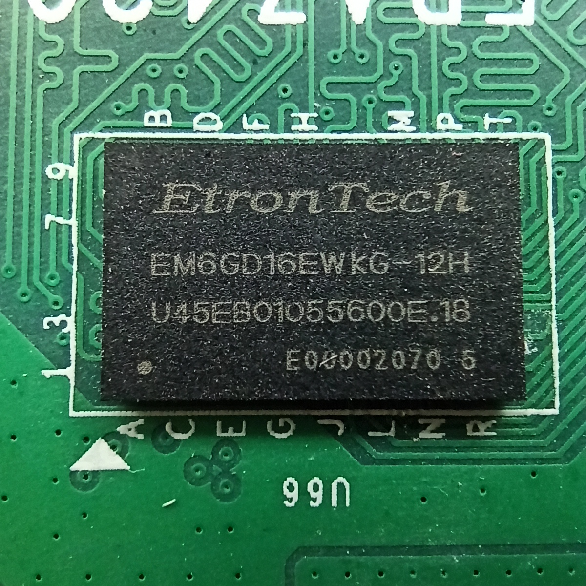
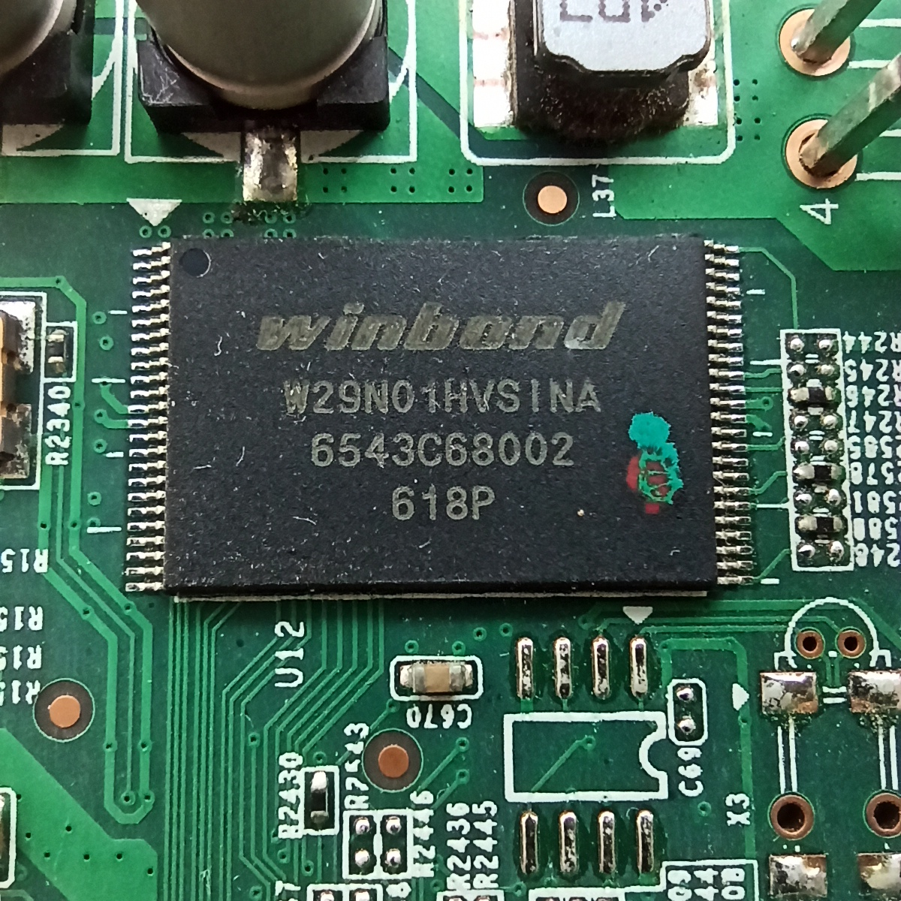
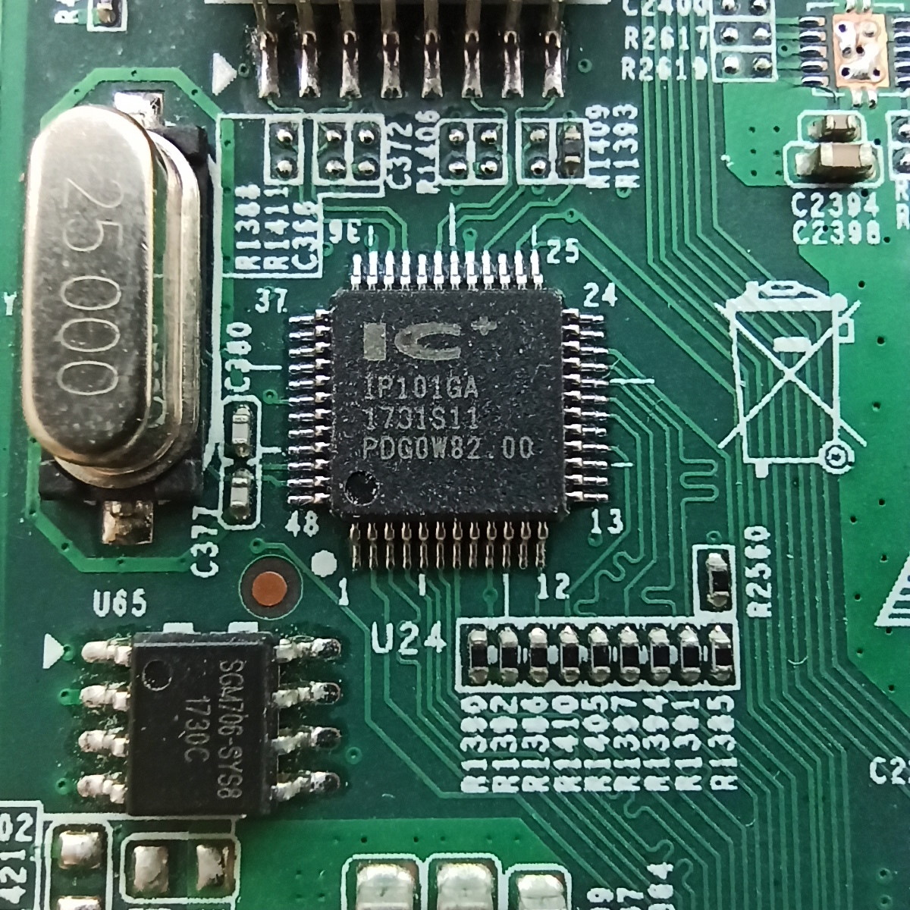
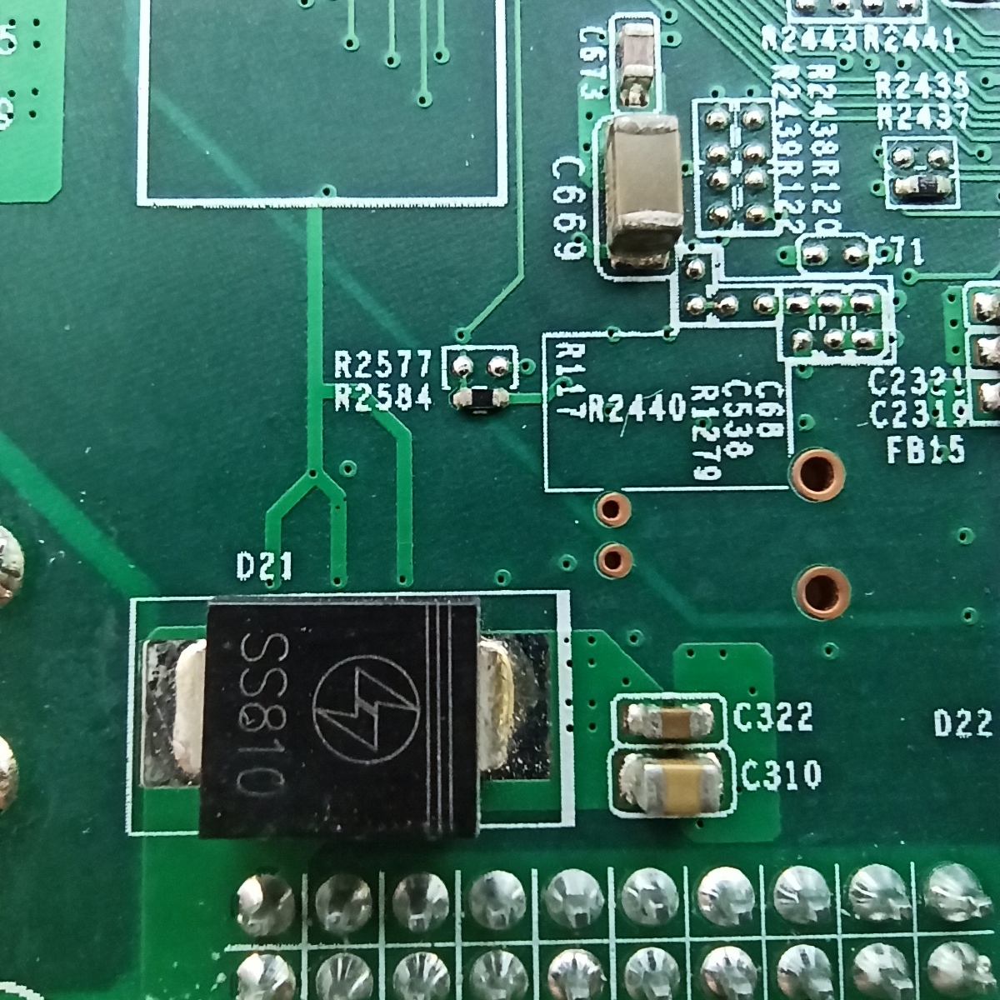

# EBAZ4205

This development board was the control card of Ebit E9+ BTC miner. In mainland China, it cost about 5 dollars (<35 CNY) on the secondhand market.

## Resources

- [Telegram group](https://t.me/ebaz4205) general chat, quick Q&A
- [Wiki](https://github.com/xjtuecho/EBAZ4205/wiki) FAQ, tutorials
- [Github discussions](https://github.com/xjtuecho/EBAZ4205/discussions) troubleshooting help, projects, development

## Hardware summary

Hardware:
- [PDF Schematic](/HW/ebaz4205/EBAZ4205-SCH.pdf)
- [Altium Designer design files](/HW/ebaz4205/altium/)
- [KiCad design files](/HW/ebaz4205/kicad/)
- [CPU info](proc/cpuinfo)

On-board linux
- [Kernel cmdline](proc/cmdline)
- [NAND Memory Map](proc/mtd)
- [Linux Version](proc/version)


The TF card socket is absent by default, you can buy and solder it by yourself if necessary. So do the UART port `J7`and the JTAG port `J8`.


On the bottom layer of the board, diode `D24` is absent by default, which you need if you want to power the board via `J3 J4 J5`. Solder a SMC schottky diode there.


XC7Z010CLG400, Dual Core Cortex A9 @ 666.66MHz and Artix-7 FPGA with 28k LEs.


256MB DDR3 Dynamic Memory.


128MB SLC NAND FLASH.


10/100Mbps Ethernet transceiver: IP101GA


BOOT Select Resistor: `R2577 and R2584`. The resistor is on `R2584` by default, which indicates boot from NAND. If you want to boot from TF card, **move** `R2584` to `R2577`.


## Powering the board

If the Schottky Diode `D24` was not mounted, you can only power the board by `DATA1` `DATA2` and `DATA3` port. Voltage 5V~12V is OK, 400mA and above is necessary. The pin distance of these three ports is 2.0mm, which is not common as 2.54mm.

After `D24` was mounted, we can power the board by J3 J4 J5. For convenience, J3 or J5 is recommended, which was originally for FAN power.

## Reset the root password of built-in linux

Use HyperTerminal or Putty to connect the TTL port, TXD RXD and GND is enough, VCC is not necessary. Power the Board, Hit `d` to enter the u-boot shell.

```
setenv nandboot "echo Copying Linux from NAND flash to RAM... && nand info && run nandroot;nand read 0x100000 0x2220000 0x300000 && fpga loadb 0 0x100000 0x300000 && nand read ${kernel_load_address} 0x300000 ${kernel_size} && nand read ${devicetree_load_address} 0x800000 ${devicetree_size}"
run nandboot
setenv bootargs 'console=ttyPS0,115200 root=/dev/mtdblock6 rootfstype=jffs2 noinitrd rw rootwait reboot=cold,hard emergency init=/bin/sh'
bootm ${kernel_load_address} - ${devicetree_load_address} init=/bin/sh
passwd
```

Use the commands above to reset the root password.

## Shut down the BTC miner program

After logging on with root, execute commands below to disable the BTC miner program.

```
mv /etc/rcS.d/S95cgminer.sh /etc/rcS.d/K95cgminer.sh
reboot
```

## Set static IP address

Edit configuration file: `/etc/network/interfaces`, add contents below.

```
auto eth0
iface eth0 inet static
address 192.168.1.205
netmask 255.255.255.0
gateway 192.168.1.1
dns-nameservers 192.168.1.1
```

Enable ethernet: `ifup eth0`.
Check ethernet status: `ethtool eth0`
Now you can use `ssh root@192.168.1.205` to connect the built-in linux.
Of course, you can use other IP address according to your network configuration.
